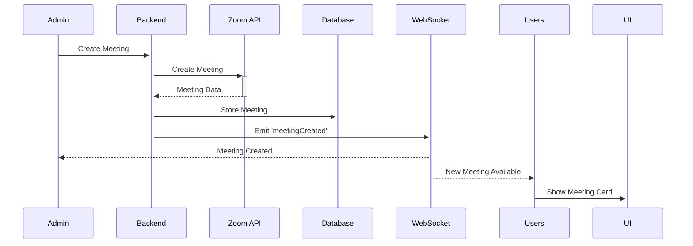
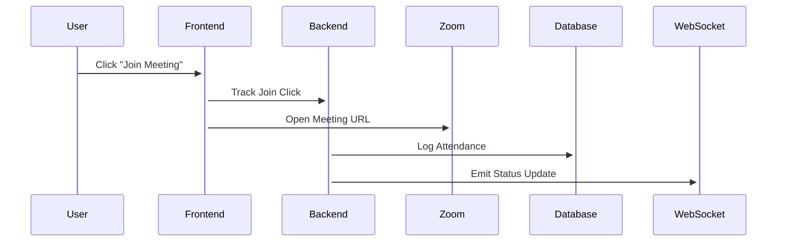

# Real-Time Zoom Meeting Integration

## Overview
Successfully implemented a complete real-time zoom meeting integration where admin-created meetings automatically appear in user dashboards with instant notifications and live status updates.

## Architecture

### 🔧 **Admin Dashboard** (EnhancedZoomDashboard)
- **Location**: `/admin-dashboard/zoom-integration`
- **Features**:
  - Create meetings with full configuration
  - Real-time WebSocket connection status
  - Live meeting status updates
  - Meeting management (create, end, view details)
  - Real-time tracking tab with ZoomRealTimeTracker
  - Connection status indicator in header

### 👥 **User Dashboard** (UserZoomDashboard) 
- **Location**: `/dashboard/ZoomIntegration`
- **Features**:
  - Real-time meeting discovery (appears when admin creates)
  - Live status updates (waiting → started → ended)
  - Join meeting with attendance tracking
  - Live connection status
  - Filtered view (only active/joinable meetings)

## Real-Time Flow

### 1. **Admin Creates Meeting**
```javascript
// Admin clicks "Create Meeting"
POST /api/zoom/enhanced/create-meeting
↓
Backend creates Zoom meeting
↓
Backend emits WebSocket event: 'meetingCreated'
↓
All connected clients receive the meeting data
```

### 2. **User Sees Meeting Instantly**
```javascript
// UserZoomDashboard WebSocket listener
socket.on('meetingCreated', (meeting) => {
  // Meeting appears in user dashboard immediately
  setMeetings(prev => [meeting, ...prev]);
  showNotificationMessage(`🎉 New meeting available: "${meeting.topic}"`, 'info');
});
```

### 3. **Live Status Updates**
```javascript
// Both Admin and User dashboards listen for status changes
socket.on('meetingStarted', (data) => {
  // Meeting status updates from 'waiting' to 'started'
  // Users see "Live Now" status
  // Admins see real-time participant data
});

socket.on('meetingEnded', (data) => {
  // Meeting removed from user view
  // Admins see historical data
});
```

## WebSocket Events

### 📤 **Events Emitted by Backend**
- `meetingCreated` - New meeting created by admin
- `meetingStarted` - Meeting went live
- `meetingEnded` - Meeting finished
- `meetingStatusUpdate` - General status changes

### 📥 **Events Handled by Frontend**
- **Admin Dashboard**: All events + connection management
- **User Dashboard**: Filtered events + user-focused notifications

## Components

### 🎛️ **EnhancedZoomDashboard.jsx** (Admin)
```javascript
// Key Features:
- WebSocket connection with admin-specific handlers
- Meeting creation form with full settings
- Real-time meeting table with status indicators
- Connection status in header (Live/Offline)
- Context menu for meeting actions
- Floating action button for quick meeting creation
```

### 👤 **UserZoomDashboard.jsx** (User)
```javascript
// Key Features: 
- WebSocket connection for real-time updates
- Meeting grid with join buttons
- Attendance tracking on join
- Live status indicators and animations
- Connection status monitoring
- Real-time notifications
```

### 📊 **ZoomRealTimeTracker.jsx** (Admin Tool)
```javascript
// Key Features:
- Real-time participant monitoring
- Connection status tracking  
- Meeting activity display
- Auto-refresh with configurable intervals
```

## Data Flow

### Meeting Creation Flow


### User Join Flow


## Backend Requirements

### API Endpoints Expected
- `POST /api/zoom/enhanced/create-meeting` - Create new meeting
- `GET /api/zoom/meetings` - Get all meetings
- `PATCH /api/zoom/meeting/:id/end` - End meeting
- `GET /api/zoom/real-time` - Real-time meeting data
- `POST /api/zoom/track-link-click` - Track user joins

### WebSocket Events Expected
- Server should emit `meetingCreated` when meeting created
- Server should emit `meetingStarted` when meeting goes live
- Server should emit `meetingEnded` when meeting ends
- Server should emit `meetingStatusUpdate` for other changes

## Environment Variables

```env
VITE_API_BASE_URL=http://localhost:5000/api
# Backend WebSocket server URL (without /api)
```

## Features in Action

### ✅ **Real-Time Meeting Discovery**
- Admin creates meeting → Users see it immediately
- No page refresh required
- Live notifications with meeting details

### ✅ **Live Status Updates**
- Meeting status changes propagate instantly
- Visual indicators update in real-time
- Connection status monitoring

### ✅ **Attendance Tracking**
- User join clicks are tracked with user details
- Meeting participation logged automatically
- Join URL opens in new tab

### ✅ **Admin Management**
- Full meeting lifecycle management
- Real-time participant monitoring
- Meeting details and settings display

## User Experience

### For Students
1. Open user dashboard → See "Zoom Meetings" in navigation
2. Available meetings appear automatically when created
3. Click "Join Live" or "Join Meeting" to participate
4. Attendance tracked automatically
5. Real-time status updates (Live Now, Ready to Join)

### For Admins
1. Open admin dashboard → Navigate to "Zoom Integration"
2. Create meetings with full configuration options
3. See all meetings in table with real-time status
4. Monitor participants in real-time tracking tab  
5. Manage meeting lifecycle (create, end, view details)

## Technical Benefits

1. **Real-Time**: No page refreshes needed for updates
2. **Scalable**: WebSocket connections handle multiple users
3. **Reliable**: Connection status monitoring and auto-reconnect
4. **User-Friendly**: Instant notifications and visual feedback
5. **Trackable**: Full attendance and participation logging
6. **Responsive**: Works on all device sizes

## Troubleshooting

### Connection Issues
- Check WebSocket connection status in UI
- Verify backend WebSocket server is running
- Ensure CORS settings allow WebSocket connections

### Meeting Not Appearing
- Check WebSocket events in browser console  
- Verify backend emits `meetingCreated` event
- Confirm meeting data structure matches expected format

### Join Tracking Issues
- Verify `/api/zoom/track-link-click` endpoint exists
- Check user data is available in frontend
- Confirm attendance logging in backend

The system now provides a seamless, real-time experience where admin-created Zoom meetings instantly appear for users to join, with full attendance tracking and live status updates!
